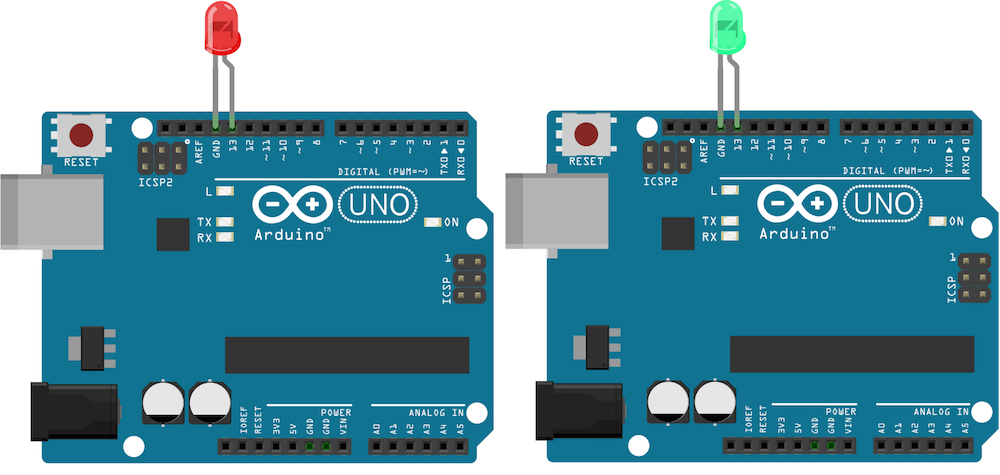

<!--remove-start-->
# Board - Multiple in one program

Run with:
```bash
node eg/board-multi.js
```
<!--remove-end-->

```javascript
var five = require("johnny-five");
var boards = new five.Boards(["A", "B"]);

// Create 2 board instances with IDs "A" & "B"
boards.on("ready", function() {

  // Both "A" and "B" are initialized
  // (connected and available for communication)

  // |this| is an array-like object containing references
  // to each initialized board.
  this.each(function(board) {

    // Initialize an Led instance on pin 13 of
    // each initialized board and strobe it.
    var led = new five.Led({
      pin: 13,
      board: board
    });

    led.blink();
  });
});

/**
 * When initializing multiple boards with only an ID string,
 * the order of initialization and connection is the order
 * that your OS enumerates ports.
 *
 * Given the above program, "A" and "B" would be assigned as:
 *
 * A => /dev/cu.usbmodem411
 * B => /dev/cu.usbmodem621
 *
 *
 * You may override this by providing explicit port paths:
 *
 * var ports = [
 *   { id: "A", port: "/dev/cu.usbmodem621" },
 *   { id: "B", port: "/dev/cu.usbmodem411" }
 * ];
 *
 * new five.Boards(ports).on("ready", function() {
 *
 *   // Boards are initialized!
 *
 * });
 */

```


## Breadboard/Illustration



[(Fritzing diagram)](breadboard/board-multi.fzz)


<!--remove-start-->
## License
Copyright (c) 2012, 2013, 2014 Rick Waldron <waldron.rick@gmail.com>
Licensed under the MIT license.
Copyright (c) 2014, 2015 The Johnny-Five Contributors
Licensed under the MIT license.
<!--remove-end-->
