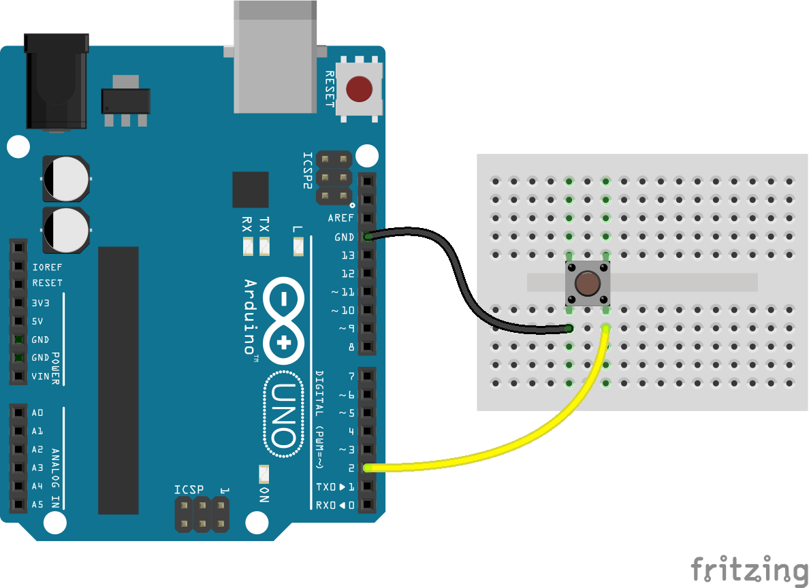

<!--remove-start-->
# Button - Pullup

Run with:
```bash
node eg/button-pullup.js
```
<!--remove-end-->

```javascript
// The `isPullup` button option enables the pullup
// resistor on the pin and automatically sets the
// `invert` option to true

// In this circuit configuration, the LED would always
// be on without the pullup resistor enabled

// For more info on pullup resistors, see:
// http://arduino.cc/en/Tutorial/InputPullupSerial
// http://arduino.cc/en/Tutorial/DigitalPins
// https://learn.sparkfun.com/tutorials/pull-up-resistors

var five = require("johnny-five"),
  button, led;

five.Board().on("ready", function() {

  button = new five.Button({
    pin: 2,
    isPullup: true
  });

  led = new five.Led(13);

  button.on("down", function(value) {
    led.on();
  });

  button.on("up", function() {
    led.off();
  });

});

```


## Breadboard/Illustration



[(Fritzing diagram)](breadboard/button-pullup.fzz)


<!--remove-start-->
## License
Copyright (c) 2012, 2013, 2014 Rick Waldron <waldron.rick@gmail.com>
Licensed under the MIT license.
Copyright (c) 2014, 2015 The Johnny-Five Contributors
Licensed under the MIT license.
<!--remove-end-->
