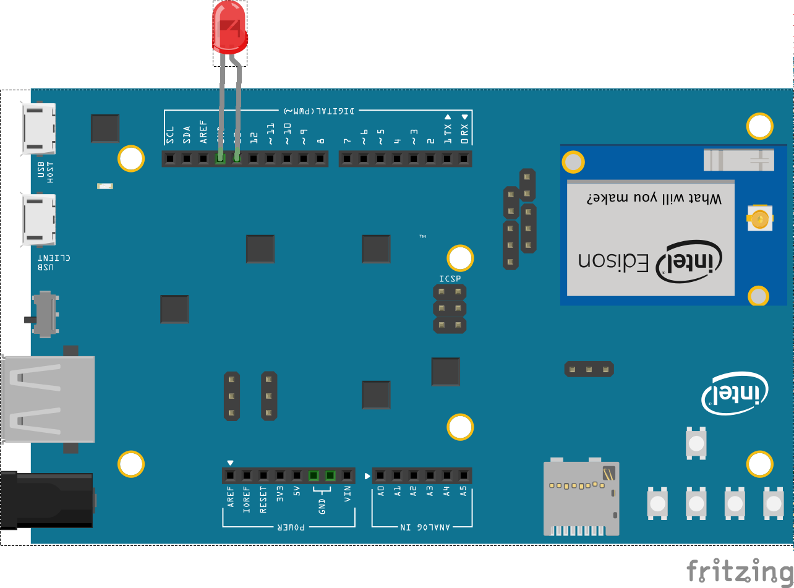
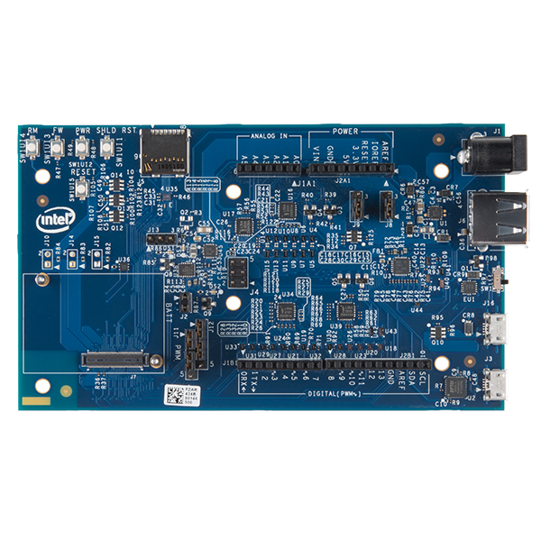

<!--remove-start-->

# Led Blink on Intel Edison Arduino Board


Example using Johnny-Five + Edison-IO to directly control an Intel Edison


### LED on pin 13


<br>

Fritzing diagram: [docs/breadboard/led-13-edison-arduinoboard.fzz](breadboard/led-13-edison-arduinoboard.fzz)

&nbsp;


Run with:
```bash
node eg/edison-io-arduino.js
```

<!--remove-end-->

```javascript
var five = require("johnny-five");
var Edison = require("edison-io");
var board = new five.Board({
  io: new Edison()
});

board.on("ready", function() {
  var led = new five.Led(13);
  led.blink();
});


```


## Illustrations / Photos


### Intel Edison Arduino Board


  


## Additional Notes

In order to use the Edison-IO library, you will need to flash the Intel IoTDevKit Image
on your Edison. Once the environment is created, install Johnny-Five and Edison-IO.

```sh
npm install johnny-five edison-io
```


## Learn More

- [edison-io on GitHub](https://github.com/rwaldron/edison-io/)

&nbsp;

<!--remove-start-->

## License
Copyright (c) 2012, 2013, 2014 Rick Waldron <waldron.rick@gmail.com>
Licensed under the MIT license.
Copyright (c) 2014, 2015 The Johnny-Five Contributors
Licensed under the MIT license.

<!--remove-end-->
