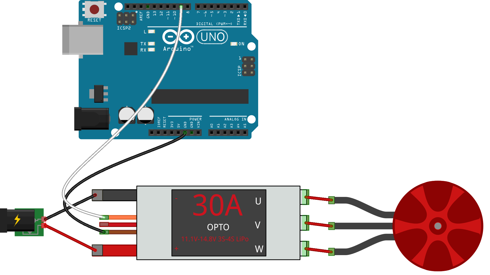

# Esc Keypress

Run with:
```bash
node eg/esc-keypress.js
```


```javascript
var five = require("johnny-five");
var keypress = require("keypress");

var board = new five.Board();

board.on("ready", function() {

  var esc = new five.ESC(12);

  // Initialize the ESCs speed to 0
  esc.to(0);

  // Hold shift+arrow-up, shift+arrow-down to incrementally
  // increase or decrease speed.

  function controller(ch, key) {
    var isThrottle = false;
    var speed = esc.last ? esc.speed : 0;

    if (key && key.shift) {
      if (key.name === "up") {
        speed += 1;
        isThrottle = true;
      }

      if (key.name === "down") {
        speed -= 1;
        isThrottle = true;
      }

      if (isThrottle) {
        esc.to(speed);
      }
    }
  }

  this.repl.inject({
    esc: esc
  });


  keypress(process.stdin);

  process.stdin.on("keypress", controller);
  process.stdin.setRawMode(true);
  process.stdin.resume();
});

// Brushless motor breadboard diagram originally published here:
// http://robotic-controls.com/learn/projects/dji-esc-and-brushless-motor

```


## Breadboard/Illustration





## Contributing
All contributions must adhere to the [Idiomatic.js Style Guide](https://github.com/rwldrn/idiomatic.js),
by maintaining the existing coding style. Add unit tests for any new or changed functionality. Lint and test your code using [grunt](https://github.com/cowboy/grunt).

## License
Copyright (c) 2012 Rick Waldron <waldron.rick@gmail.com>
Licensed under the MIT license.
