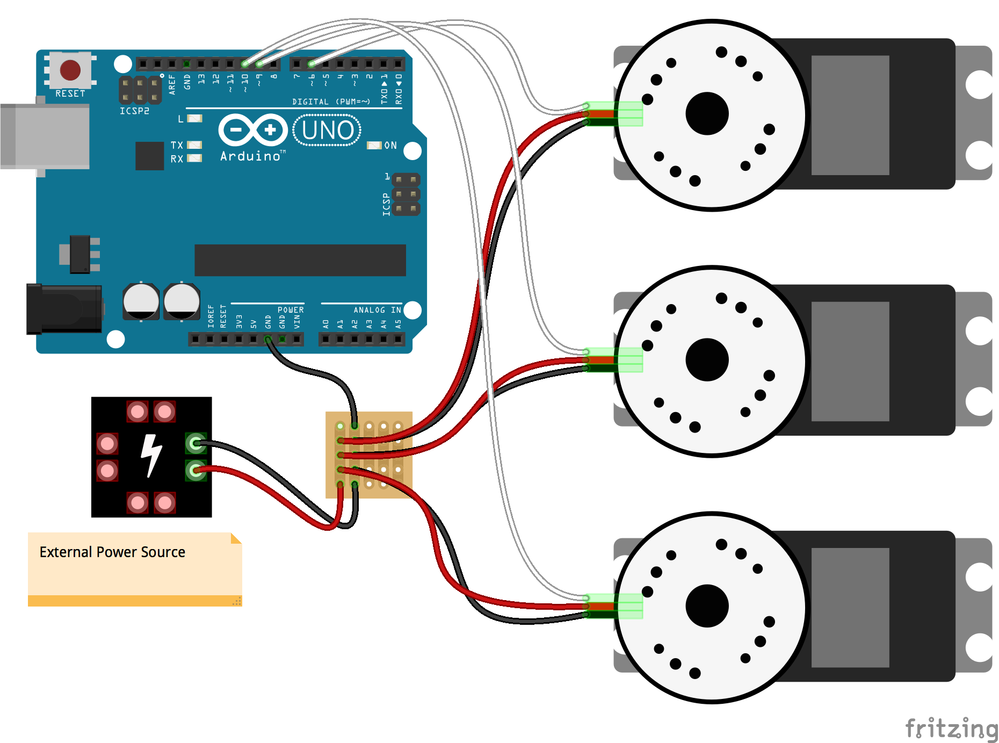
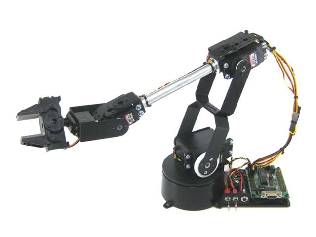

<!--remove-start-->

# Kinect Robotic Arm Controller

<!--remove-end-->


### Breadboard for "Kinect Robotic Arm Controller"


<br>

Fritzing diagram: [docs/breadboard/kinect-arm-controller.fzz](breadboard/kinect-arm-controller.fzz)

&nbsp;


Run with:
```bash
node eg/kinect-arm-controller.js
```


```javascript
var five = require("johnny-five");
/**
 * PVector is a slightly-ported version of
 * Processing's PVector.
 */
var PVector = require("./pvector").PVector;
/**
 * To run this program you must first install
 * libusb and OpenNI... Good luck with that.
 *
 * Two sets of instructions are available:
 * - https://github.com/OpenNI/OpenNI
 * - https://code.google.com/p/simple-openni/wiki/Installation
 */
var OpenNI = require("openni");

/**
 * Skeletons
 * @type Array An array of completed skeletons
 */
var Skeletons = [];

var status = {
  true: "IN FRAME",
  false: "OUT OF FRAME"
};

var defs = [
  // "Pivot/Rotator"
  {
    id: "rotator",
    pin: 6,
    range: [0, 180],
    startAt: 90
  },
  // "Shoulder"
  {
    id: "upper",
    pin: 9,
    range: [0, 180],
    startAt: 180
  },
  // "Elbow"
  {
    id: "fore",
    pin: 10,
    range: [90, 180],
    startAt: 90
  },
];

var board = new five.Board();

board.on("ready", function() {

  // Reduce the defs array into a plain object
  // of stored servo instances, where the servo
  // id is the property name.
  var servos = defs.reduce(function(initialized, def) {
    return (initialized[def.id] = five.Servo(def), initialized);
  }, {});

  // Initialize the OpenNI/Kinect
  var kinect = new OpenNI();

  // For each declared Skeleton.Joints, bind
  // an event handler to the joint event by name.
  Skeleton.Joints.forEach(function(joint) {
    // When joint data is received, update the
    // associated Skeleton's joints array
    // with data for the given joint.
    kinect.on(joint, function(id, x, y, z) {
      var skeleton, vector;

      skeleton = Skeletons[id];

      if (skeleton) {

        vector = skeleton.joints[joint];

        if (vector) {
          vector.x = x;
          vector.y = y;
          vector.z = z;
        }
      }
    });
  });

  Skeleton.Events.forEach(function(type) {
    kinect.on(type, function(id) {
      var isPresence, skeleton;

      // Limit the number of skeletons to one.
      if (id !== 1) {
        return;
      }

      console.log("%s (%d)", type, id);

      isPresence = ["newuser", "lostuser"].some(function(val) {
        return val === type;
      });

      if (isPresence) {
        skeleton = Skeletons[id];

        if (!skeleton) {
          skeleton = Skeletons[id] = new Skeleton();
        }

        skeleton.inFrame = type === "newuser" ?
          true : false;

        console.log(status[skeleton.inFrame]);
      }
    });
  });

  var last = Date.now();
  var interval = 1000 / 30;
  var rlow = 0;
  var rhigh = 0;
  var change = {
    upper: new Change(2),
    fore: new Change(2),
    rotator: new Change(2)
  };

  void (function main() {
    setImmediate(main);

    var joints, right, orientation, upper, fore, rotator, axis;

    var now = Date.now();

    if (now < last + interval) {
      return;
    }

    last = now;

    var values = {
      upper: 0,
      fore: 0,
      rotator: 0
    };

    var angles = {
      upper: 0,
      fore: 0
    };

    if (Skeletons.length && (joints = Skeletons[1].joints)) {
      upper = joints.right_shoulder;
      fore = joints.right_elbow;
      rotator = joints.right_hand;
      axis = joints.right_hip;

      if (upper && fore && rotator && axis) {

        right = {
          upper: new PVector(upper.x, upper.y),
          fore: new PVector(fore.x, fore.y),
          rotator: new PVector(rotator.x, rotator.y),
          axis: new PVector(axis.x, axis.y)
        };

        orientation = {
          torso: PVector.sub(right.upper, right.axis),
          arm: PVector.sub(right.fore, right.upper)
        };

        if (rlow === 0 || rlow > rotator.z) {
          rlow = Math.round(rotator.z);
        }

        if (rhigh === 0 || rhigh < rotator.z) {
          rhigh = Math.round(rotator.z);
        }

        angles.upper = Math.round(
          angleOf(right.fore, right.upper, orientation.torso)
        );

        angles.fore = Math.round(
          angleOf(right.rotator, right.fore, orientation.arm)
        );

        values.upper = scale(angles.upper, 0, 180, 180, 0);
        values.fore = scale(angles.fore, 180, 0, 90, 180);

        // When the elbow/hand are higher then the shoulder,
        // flip the scaled rotator value.
        values.rotator = values.upper < 110 && values.fore > 110 ?
          scale(rotator.z, rlow, rhigh, 180, 0) :
          scale(rotator.z, rlow, rhigh, 0, 180);

        // Once all of the Kinect joint vectors have been
        // calculated and scaled to a value in degrees,
        // do a final check to ensure that a move is worth
        // making and if so, set the servo position
        //
        if (change.rotator.isNoticeable(values.rotator)) {
          servos.rotator.to(values.rotator);
        }

        if (change.upper.isNoticeable(values.upper)) {
          servos.upper.to(values.upper);
        }

        if (change.fore.isNoticeable(values.fore)) {
          servos.fore.to(values.fore);
        }
      }
    }
  })();
  // References
  // http://www.ranchbots.com/robot_arm/images/arm_diagram.jpg
  // https://github.com/OpenNI/OpenNI/blob/master/Include/XnCppWrapper.h
  // http://www.mrtmrcn.com/en/post/2011/11/08/Kinect-Part-5-Kinect-Skeleton-Tracking.aspx
  // http://code.google.com/p/bikinect/source/browse/trunk/MappInect/Skeleton.pde
  // https://github.com/Sensebloom/OSCeleton-examples/blob/master/processing/Stickmanetic/Stickmanetic.pde
  // http://www.pcl-users.org/openni-device-h-47-26-fatal-error-XnCppWrapper-h-No-such-file-or-directory-td3174297.html
  // http://kinectcar.ronsper.com/docs/openni/_xn_cpp_wrapper_8h_source.html
});

/**
 * Joint
 * @param {Object} initializer { [x, [y, [z]]] }
 */
function Joint(initializer) {
  Object.assign(this, Joint.DEFAULTS, initializer || {});
}

Object.freeze(
  Joint.DEFAULTS = {
    x: 0,
    y: 0,
    z: 0
  }
);
/**
 * Skeleton
 *
 * Initialize a "collection" of Joint objects
 * as a cohesive data type
 *
 * @param {Object} initializer { joints = {} }
 */
function Skeleton(initializer) {
  /**
   * skeleton {
   *   joints, kinect
   * }
   */
  five.Fn.assign(
    this, Skeleton.DEFAULTS, initializer || {}
  );

  // Initialize each declared Joint in Skeleton.Joints
  Skeleton.Joints.forEach(function(joint) {
    this.joints[joint] = new Joint();
  }, this);
}

Object.freeze(
  Skeleton.DEFAULTS = {
    inFrame: false,
    joints: {}
  }
);

Skeleton.Joints = [
  "head",
  "neck",

  "torso",
  "waist",

  "left_shoulder",
  "left_elbow",
  "left_hand",

  "right_shoulder",
  "right_elbow",
  "right_hand",

  "left_hip",
  "left_knee",
  "left_foot",

  "right_hip",
  "right_knee",
  "right_foot"
];

Skeleton.Events = [
  "newuser",
  "lostuser",
  "posedetected",
  "calibrationstart",
  "calibrationsuccess",
  "calibrationfail"
];

/**
 * Change
 *
 * Produces change "tracking" instances
 * to determine if a given value has changed
 * drastically enough
 */
function Change(margin) {
  this.last = 0;
  this.margin = margin || 0;
}
/**
 * isNoticeable
 *
 * Determine if a given value has changed
 * enough to be considered "noticeable".
 *
 * @param  {Number} value  [description]
 * @param  {Number} margin Optionally override the
 *                         change instance's margin
 *
 * @return {Boolean} returns true if value is different
 *                           enough from the last value
 *                           to be considered "noticeable"
 */
Change.prototype.isNoticeable = function(value, margin) {
  margin = margin || this.margin;

  if (!Number.isFinite(value)) {
    return false;
  }

  if ((value > this.last + margin) || (value < this.last - margin)) {
    this.last = value;
    return true;
  }
  return false;
};

/**
 * scale Alias
 */
var scale = five.Fn.scale;

/**
 * angleOf
 *
 * Produce the angle of 2 vectors on a given axis.
 *
 * @param  {PVector} vec1
 * @param  {PVector} vec2
 * @param  {PVector} axis
 *
 * @return {Number} Radians converted to degrees
 */
function angleOf(vec1, vec2, axis) {
  return PVector.degrees(
    PVector.between(
      PVector.sub(vec2, vec1), axis
    )
  );
}

```


## Illustrations / Photos


### Robotic Arm


Assembled Robotic Arm from LynxMotion


  

### Arm Diagram


Illustrates arm joint connections.


  


<iframe width="560" height="315" src="https://www.youtube.com/embed/VCjbUJzYYvI" frameborder="0" allowfullscreen></iframe>


## Learn More

- [JavaScript: Kinect Controlled Robot Arm](http://bocoup.com/weblog/javascript-arduino-kinect-robot-arm/)

- [LynxMotion: AL5D Robotic Arm](http://www.lynxmotion.com/c-130-al5d.aspx)

&nbsp;

<!--remove-start-->

## License
Copyright (c) 2012, 2013, 2014 Rick Waldron <waldron.rick@gmail.com>
Licensed under the MIT license.
Copyright (c) 2014, 2015 The Johnny-Five Contributors
Licensed under the MIT license.

<!--remove-end-->
