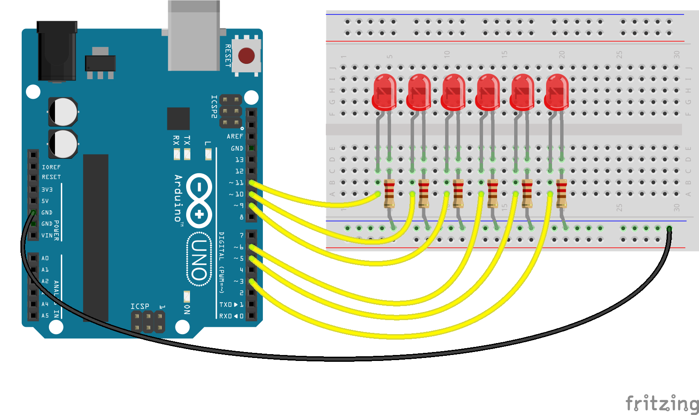

<!--remove-start-->

# LED - Fade callback


Demonstrates use of callbacks to fade out a series of LEDs one after the other. Requires LEDs on pins that support PWM (usually denoted by ~).


Run with:
```bash
node eg/led-fade-callback.js
```

<!--remove-end-->

```javascript
var five = require("johnny-five"),
  board;

board = new five.Board();

board.on("ready", function() {
  // Set up the following PWM pins as LEDs.
  // Fade an LED out, and the complete callback will start
  // fading the next LED in sequence out, and so on.
  // If randomFade is true, then fading will happen in random
  // order instead of sequentially.
  var pins = [11, 10, 9, 6, 5, 3],
    timing = 250,
    randomFade = true,
    myLEDS = [],
    fadeIndex = 0,
    ledCount = pins.length,
    i;

  function fadeNext() {
    var candidateIndex = fadeIndex;
    myLEDS[fadeIndex].fadeIn(timing);

    // Determine the next LED to fade
    if (randomFade) {
      while (candidateIndex === fadeIndex) {
        candidateIndex = Math.round(Math.random() * (ledCount - 1));
      }
    } else {
      candidateIndex = (fadeIndex < ledCount - 1) ? fadeIndex + 1 : 0;
    }
    fadeIndex = candidateIndex;

    myLEDS[fadeIndex].fadeOut(timing, fadeNext);
  }

  for (i = 0; i < ledCount; i++) {
    myLEDS[i] = new five.Led(pins[i]);
    myLEDS[i].on();
  }
  myLEDS[fadeIndex].fadeOut(timing, fadeNext);

});

```


## Illustrations / Photos


### Breadboard for "LED - Fade callback"


<br>

Fritzing diagram: [docs/breadboard/led-fade-callback.fzz](breadboard/led-fade-callback.fzz)

&nbsp;


&nbsp;

<!--remove-start-->

## License
Copyright (c) 2012, 2013, 2014 Rick Waldron <waldron.rick@gmail.com>
Licensed under the MIT license.
Copyright (c) 2014, 2015 The Johnny-Five Contributors
Licensed under the MIT license.

<!--remove-end-->
