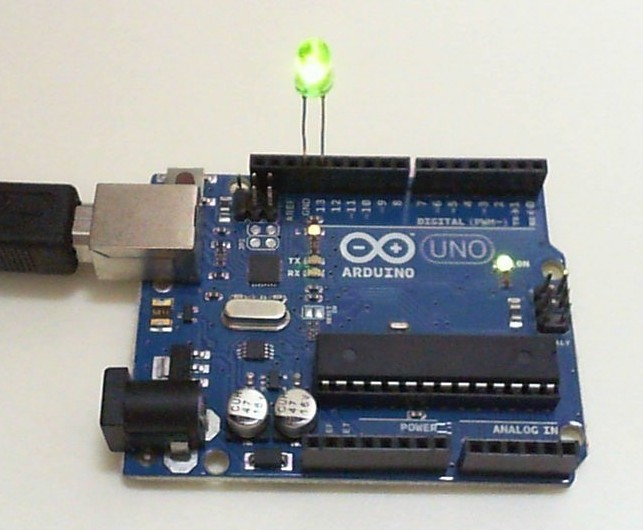
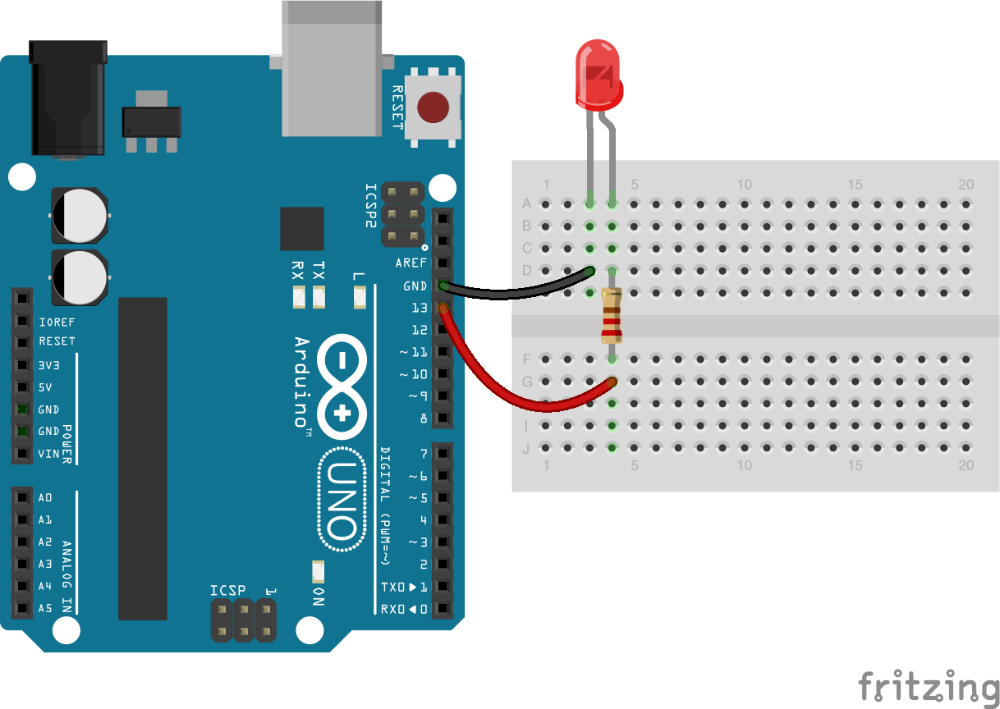
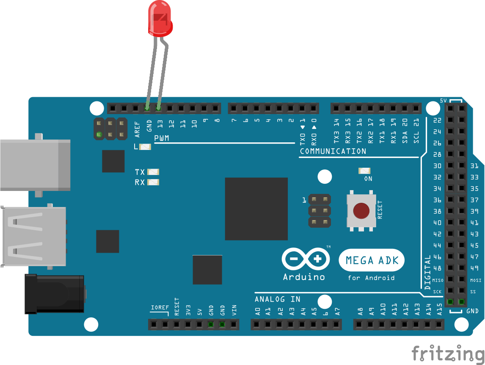

<!--remove-start-->

# LED


Basic LED example


Run with:
```bash
node eg/led.js
```

<!--remove-end-->

```javascript
var five = require("johnny-five");
var board = new five.Board();

board.on("ready", function() {
  var led = new five.Led(13);

  // This will grant access to the led instance
  // from within the REPL that's created when
  // running this program.
  this.repl.inject({
    led: led
  });

  led.blink();
});


```


## Illustrations / Photos


### LED on pin 13 (Arduino UNO)


Basic example with LED inserted directly into pin 13


  

### LED on pin 13 (Arduino UNO)


Basic example with LED inserted directly into pin 13


<br>
Fritzing diagram: [docs/breadboard/led-13.fzz](breadboard/led-13.fzz)

&nbsp;
### LED on pin 13 with breadboard and resistor (Arduino UNO)


Basic example with LED on a breadboard and demonstrating use of a resistor


<br>
Fritzing diagram: [docs/breadboard/led-resistor.fzz](breadboard/led-resistor.fzz)

&nbsp;
### LED on pin 13 (Arduino Mega)


Basic example with LED inserted directly into pin 13


<br>
Fritzing diagram: [docs/breadboard/led-13-mega.fzz](breadboard/led-13-mega.fzz)

&nbsp;


## Additional Notes
This script will make `led` available in the REPL, by default on pin 13.
Now you can try, e.g.:

```js
>> led.stop() // to stop blinking
// then
>> led.off()  // to shut it off (stop doesn't mean "off")
// then
>> led.on()   // to turn on, but not blink
```


&nbsp;

<!--remove-start-->

## License
Copyright (c) 2012, 2013, 2014 Rick Waldron <waldron.rick@gmail.com>
Licensed under the MIT license.
Copyright (c) 2014, 2015 The Johnny-Five Contributors
Licensed under the MIT license.

<!--remove-end-->
